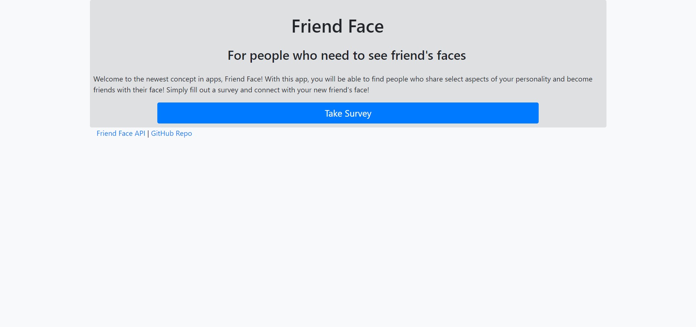
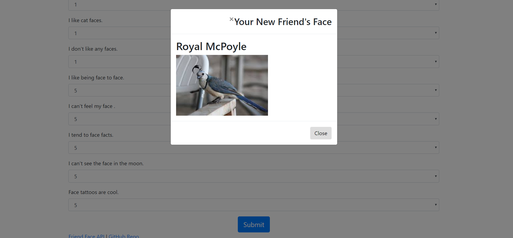

# Friend Face
An app for finding friend's faces!

This app helps you find friends, especially their faces!

# Table of Contents

    Visuals

    Link

Simply select the "Take Survey" button to start!

Information about the current users is presented when the "Face Friend API" is selected from the bottom left. My GitHub page is avalible from the "GitHub repo" link, also in the bottom left. These are also avalible on the survey page.

From the survey page, provide your name and a link to a picture as well as fill out the survey questions, and you will be linked to your new best friend's face! Each part must be filled out for the survey to return you a friend match. To submit the survey, press the submit button.

Once you have submitted a survey, a pop-up will show you your new friends face! Enjoy!

# Link to deployed page:

    - https://safe-hollows-35552.herokuapp.com/

# Technologies Used

- HTML
- CSS
- Bootstrap
- JavaScript
- jQuery
- node.js
- body-parser.js
- Express.js

Author

John Caldwell